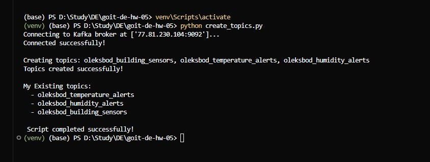
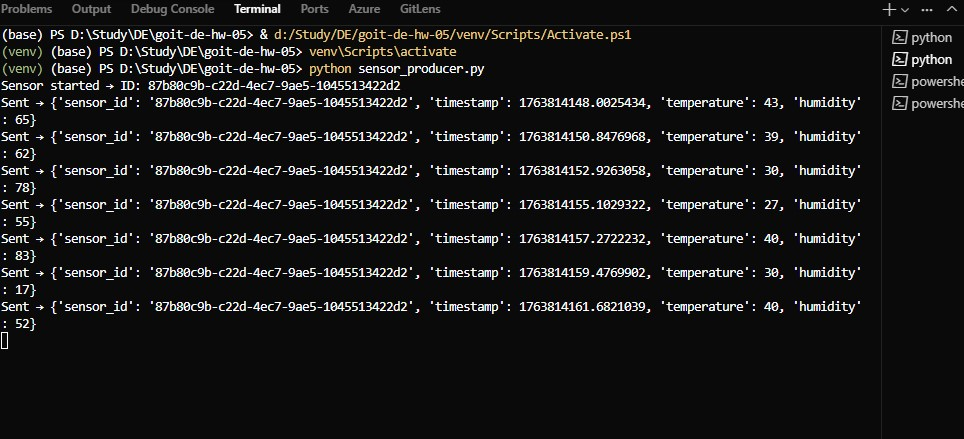
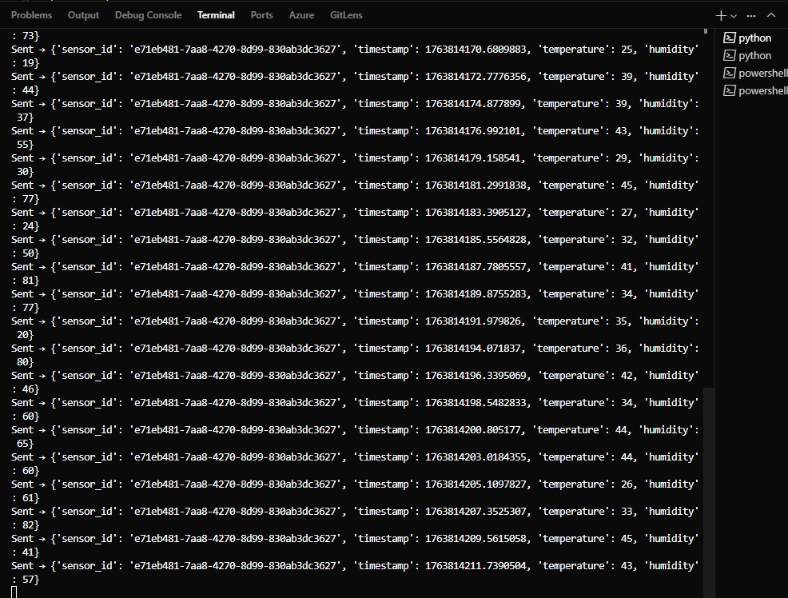
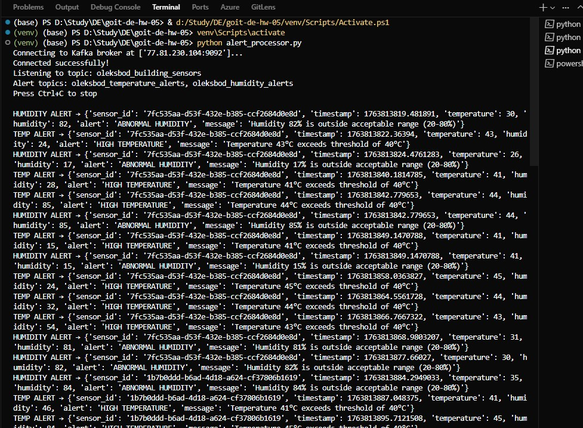
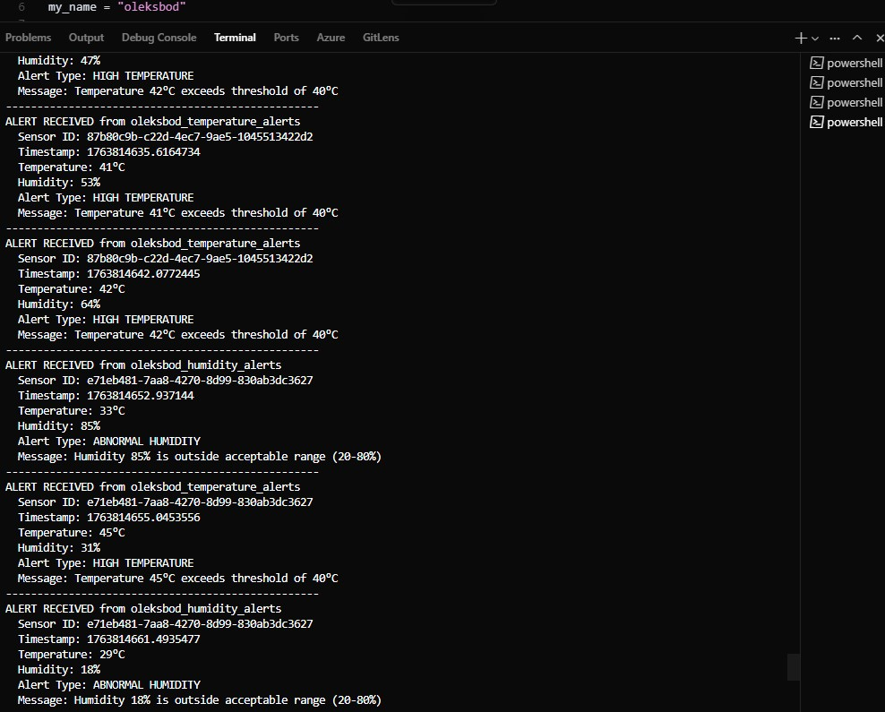

# Система моніторингу IoT датчиків з використанням Apache Kafka

## Опис завдання

Проект реалізує систему моніторингу для Інтернету Речей (IoT), яка збирає дані з різних датчиків, встановлених у будівлях, та аналізує їх в реальному часі для відстеження температури та вологості. Система використовує Apache Kafka як платформу обміну повідомленнями для ефективної передачі та обробки великих обсягів даних.

## Етапи виконання

### Етап 1: Створення топіків в Kafka

**Результат:** Створено 3 топіки для роботи системи



### Етап 2: Генерація даних сенсорів

**Результат:** Датчики генерують та відправляють дані в топік `building_sensors`





### Етап 3: Обробка та фільтрація даних

**Результат:** Система зчитує дані з `building_sensors` та фільтрує їх за критеріями

Скрипт підписується на топік `building_sensors` та:

-   Зчитує всі вхідні повідомлення від датчиків
-   Перевіряє кожне повідомлення на порогові значення:
    -   **Температура > 40°C** → готує сповіщення про високу температуру
    -   **Вологість > 80% або < 20%** → готує сповіщення про аномальну вологість
-   Виводить відфільтровані дані для моніторингу



### Етап 4: Відправка сповіщень у топіки

**Результат:** Відфільтровані дані відправляються у відповідні топіки сповіщень

Після фільтрації система:

-   Генерує структуровані сповіщення з усією необхідною інформацією:
    -   Ідентифікатор датчика (sensor_id)
    -   Значення показників (temperature, humidity)
    -   Час отримання даних (timestamp)
    -   Тип сповіщення (alert)
    -   Повідомлення про перевищення порогу (message)
-   Відправляє сповіщення про температуру в топік `temperature_alerts`
-   Відправляє сповіщення про вологість в топік `humidity_alerts`


### Етап 5: Відображення сповіщень

**Результат:** Система виводить всі сповіщення на екран для моніторингу

Скрипт підписується на обидва топіки сповіщень (`temperature_alerts` та `humidity_alerts`) та:

-   Зчитує всі сповіщення в реальному часі
-   Виводить структуровану інформацію про кожне сповіщення:
    -   Звідки отримано (назва топіку)
    -   Ідентифікатор датчика
    -   Час отримання даних
    -   Значення температури та вологості
    -   Тип сповіщення
    -   Детальне повідомлення



## Запуск

1. **Активуйте віртуальне середовище:**

    ```bash
    # PowerShell
    .\venv\Scripts\Activate.ps1

    # Command Prompt
    venv\Scripts\activate.bat
    ```

2. **Перевірте конфігурацію:**
    - Файл `configs.py` містить налаштування підключення до Kafka брокера
    - Переконайтеся, що `my_name` однаковий у всіх файлах

### Послідовність запуску

#### Крок 1: Створення топіків

```bash
python create_topics.py
```

Створює три необхідні топіки в Kafka.

#### Крок 2: Запуск датчиків (у різних терміналах)

**Термінал 1:**

```bash
python sensor_producer.py
```

**Термінал 2 (новий):**

```bash
python sensor_producer.py
```

Кожен запуск створює окремий датчик з унікальним ID.

#### Крок 3: Запуск обробника даних

**Термінал 4 (новий):**

```bash
python alert_processor.py
```

Обробляє дані з `building_sensors`, фільтрує їх та відправляє сповіщення.

#### Крок 4: Запуск споживача сповіщень

**Термінал 5 (новий):**

```bash
python alert_consumer.py
```

Відображає всі сповіщення про температуру та вологість.

### Повний пайплайн

Для повної демонстрації системи запустіть всі компоненти одночасно:

1. **Термінал 1:** `python create_topics.py` (один раз)
2. **Термінал 2-3:** `python sensor_producer.py` (2+ екземпляри)
3. **Термінал 4:** `python alert_processor.py`
4. **Термінал 5:** `python alert_consumer.py`

Система почне обробляти дані в реальному часі, генеруючи сповіщення при перевищенні порогових значень.

## Структура проекту

```
goit-de-hw-05/
├── screenshots/
│   ├── topics.jpg              # Скриншот створення топіків
│   ├── producer_1.jpg          # Скриншот першого датчика
│   ├── producer_2.jpg          # Скриншот другого датчика
│   ├── processor.jpg           # Скриншот обробки та фільтрації
│   └── alerts_topics.jpg       # Скриншот отримання сповіщень
├── venv/                       # Віртуальне середовище Python
├── alert_consumer.py           # Споживач сповіщень (Етап 5)
├── alert_processor.py          # Обробник та фільтр даних (Етапи 3-4)
├── configs.py                  # Конфігурація підключення до Kafka
├── create_topics.py            # Створення топіків (Етап 1)
├── sensor_producer.py          # Генератор даних датчиків (Етап 2)
└── README.md                   # Документація проекту
```

## Технічні деталі

### Топіки Kafka

-   **building_sensors** - основний топік для даних від датчиків
-   **temperature_alerts** - топік для сповіщень про температуру
-   **humidity_alerts** - топік для сповіщень про вологість

### Порогові значення

-   **Температура:** > 40°C (генерує сповіщення)
-   **Вологість:** > 80% або < 20% (генерує сповіщення)

### Діапазони генерації

-   **Температура:** 25-45°C (випадкове значення)
-   **Вологість:** 15-85% (випадкове значення)

### Формат даних

**Дані від датчика:**

```json
{
    "sensor_id": "uuid",
    "timestamp": 1234567890.123,
    "temperature": 35,
    "humidity": 60
}
```

**Сповіщення:**

```json
{
    "sensor_id": "uuid",
    "timestamp": 1234567890.123,
    "temperature": 42,
    "humidity": 60,
    "alert": "HIGH TEMPERATURE",
    "message": "Temperature 42°C exceeds threshold of 40°C"
}
```

## Налаштування

### Зміна префіксу топіків

У всіх файлах знайдіть змінну `my_name` та змініть на своє ім'я:

```python
my_name = "your_name"  # Замініть на своє ім'я
```

### Конфігурація брокера

Відредагуйте `configs.py` для зміни налаштувань підключення:

```python
kafka_config = {
    "bootstrap_servers": ['your-broker:9092'],
    "username": 'your_username',
    "password": 'your_password',
    "security_protocol": 'SASL_PLAINTEXT',
    "sasl_mechanism": 'PLAIN'
}
```
